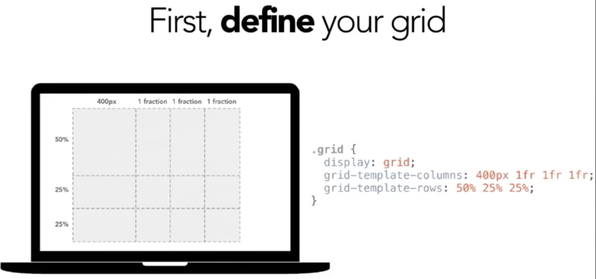
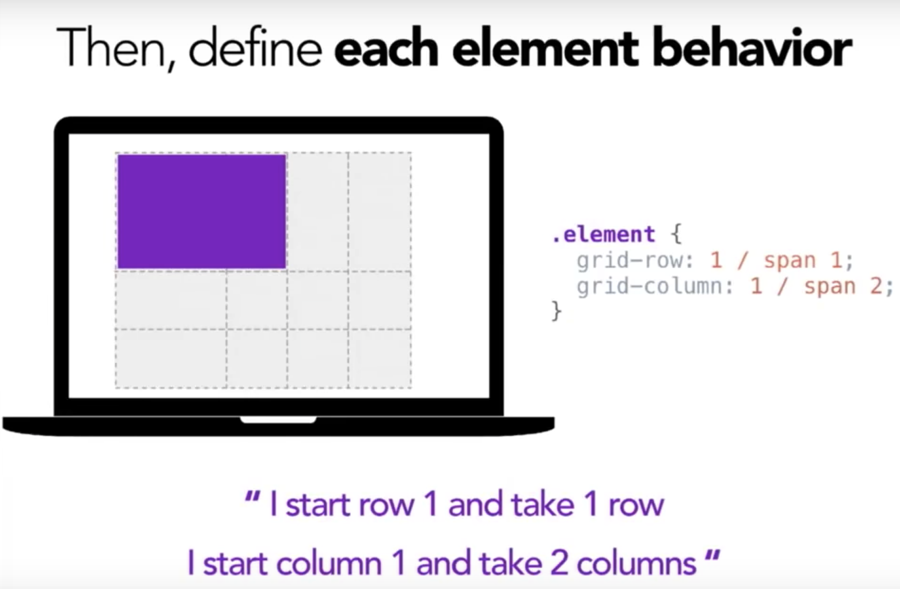
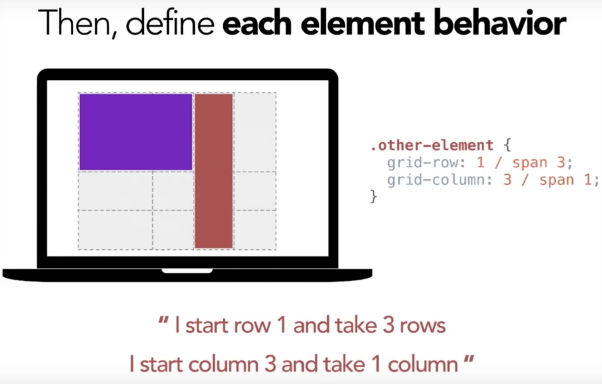

#Documentation

## Convention BEM

* B -> Block
* E -> Element
* M -> Modifier

```html
<!-- mainList = Block -->
<ul class="mainList mainList--xmas">
    <!--_item = Element-->
    <li class="mainList_item">
        <!--i= _itemLink = Element-->
        <a class="mainList_item_link mainList_itemLink--isActive"href="/home">Accueil</a>
    </li>   

    <!--_item = Element-->
    <li class="mainList_item">
        <!--i= _itemLink = Element-->
        <a class="mainList_item_link"href="/about">About</a>
    </li>  

    <!--_item = Element-->
    <li class="mainList_item">
        <!--i= _itemLink = Element-->
        <a class="mainList_item_link"href="/works">Works</a>
    </li>   
</ul>
```

Exemple en SCSS :
```css

.mainList {
    display : flex;
    justify_content: space-between;
    &--xmas{
        background : green;
    }
    &_item {
        list-style: none;
    }
    &itemLink {
        color:red;
        &--isActive {
            color : white;
        }
    }
}
```

Exemple en CSS du rendu :

```css
.mainList {

}

.mainList--xmas{

}

.mainList_item {

}

.mainList_itemLink {

}

.mainList_itemLink--isActive {

}
```

## Pseudo attributs

Les pseudo attributs 'before' et 'after' permettent de créer des noeuds HTML en CSS.
Ils sont essentiellement utilisés pour ajouter des ornements, des décorations ... On
peut bien entendu faire des animations avec, les positionner par rapport à leur
parent (relative/absolute). Ils doivent obligatoirement avoir un 'content: '' '
afin de s'afficher.


```html
<section class="cover>
    <h1 class="cover_mainTitle> Présentation des pseudo-attributs</h1>
</section>
```

```css
.cover {
    background: #FDFDFD;
    padding: 20px;
    &_mainTitle {
        text-align: center;
        font-size: 24px;
        color: green;
        position: relative;
        &::before,
        &::after {
            position : absolute;
            content: '';
            width: 50px;
            height: 50px;
            background : green;
            top: 0;
        }
        &::before {
            left:0;
        }
        &::after {

            right:0;
        }
    }
}
```

## REM, EM, %, VW Sizing

## %

Les tailles en pourcentages sont relatives à celles de leur parent.
L'élément ci dessous occupera la moitié de la largeur de la page.

```html
<body>
  <div>
    J'occupe la moitié de la largeur de la page.
    <div>
      J'occupe la moitié la moitié de la largeur de ma div parente,
      soit un quart de la largeur de la page.
    </div>  
  </div>  
</body>  
```
```css
body {
  width: 100%;
}
div {
  width: 50%;
}
```

## EM

Relative à la taille de son parent direct.
Utile pour les padding et margin.

```css
.cover {
    font-size : 16px;
    &_mainTitle {
        /* 1em = 16px / 0.8em = 80% de 16px */
        font-size: 0.8em;
    }
}
```

## REM

* Le REM est basé sur la taille de la racine (soit la balise <html>) qui, par
défaut à une valeur de 16px. Afin d'éviter tout calcul, il est nécessaire de l'écraser
en donnant une base de 10px soit 62.5%.
* Le REM est intéressant à utiliser si les media-queries employées sont en rem également.
Cela vous permettra de garder des proportions égales lorsqu'on va redimensionner la page.
* Ses proportions seront également gardées quand l'utilisateur zoomera dans votre page.

```css
html {
    font-size : 62.5%; //10px
}
.mainTitle {
    font-size : 1.6rem; // 16px
    width: 32rem; //320px;
}

```

## VW /VH

Unités relatives à la taille de votre écran (peu importe le device)
Attention au VH et à son contenu. 100vh = 100vh quoi qu'il arrive.
VW très utile pour les interfaces fluides.

## Positionner un élément en CSS

La propriété position définit la façon dont un élément est positionné dans un document.
Les propriétés top, right, bottom et left déterminent l'emplacement final de l'élément positionné.

### Static

Comportement normal (par défaut). L'élément est alors positionné dans le flux avec sa position.
Les propriétés top, right, bottom, left et z-index ne s'appliquent pas.

### Relative

L'élément est positionné dans le flux normal du document puis décalé, par rapport à lui-même, selon les valeurs fournies par top, right, bottom et left. Le décalage n'a pas d'impact sur la position des éléments.

```css
.element {
  position: relative;;
  right: 50px;
  top: 50px;
}
```

### Absolute

L'élément est positionné par rapport à un parent en position relative s'il en a un, sinon par rapport à la fenêtre du navigateur. La position finale de l'élément est déterminée par les valeurs de top, right, bottom et left.

#### Cas 1

```html
<div class="parent">
  <div class="enfant">
    Il y a 10px entre le bord droit de ma div parente et mon extrémité droite
  </div>  
</div>
```
```css
.parent {
  position: relative;
  width: 600px;
}
.enfant {
  position: absolute;
  right: 10px;
  width: 200px;
}
```

#### Cas 2

```html
<body>
  <div class="orphelin">
    Je suis positionné en bas à droite de la fênetre du navigateur,
    au scroll vers le bas je ne serai plus positionné tout en bas de la fenêtre mais
    je resterai aligné à droite
  </div>  
</body>   
```
```css
.orphelin {
  position: absolute;
  bottom: 0;
  right: 10px;
}
```

### Fixed

L'élément est retiré du flux normal et est positionné par rapport à la fenêtre du navigateur et restera toujours à la même place même si la page défile. Il est possible d'utiliser les propriétés top, right, bottom et left.

```css
.element {
  position: fixed;
  top: 20px;
  right: 40px;
}
```

### Sticky

Le positionnement adhérent est un mélange de positionnement relatif et de positionnement fixe. L'élément est considéré comme positionné de façon relative, jusqu'à ce qu'un seuil soit franchi. À partir de ce seuil, l'élément est positionné de façon fixe. Par exemple :
```css
.element {
  position: sticky;
  top: 10px;
}
```
se comportera comme un élément positionné de façon relative jusqu'à ce que le viewport défile au point où l'élément est à moins de 10 pixels du haut. Ensuite, il sera fixé à 10 pixels du haut, jusqu'à ce que le viewport redéfile jusqu'avant ce seuil.

## Font-face

La règle @font-face permet à une page web de charger des polices personnalisées. Une fois ajoutée à la feuille de style,
la règle indique au navigateur de télécharger la police depuis la où elle est hébergée. La règle @font-face peut être utilisée au niveau global d'une feuille de style et également au sein d'un groupe lié à une règle @ conditionnelle.

```css
@font-face {
 font-family: "Roboto";
 src: url("/fonts/Roboto.woff2") format("woff2"),
        url("/fonts/Roboto.woff") format("woff");
}

body {
  font-family: 'Roboto', sans-serif;
}
```

## Animation

Les animations CSS permettent de créer des transitions entre deux états de mise en forme. Une animation est décrite par deux choses : des propriétés propres à l'animation d'une part et un ensemble d'étapes (keyframes) qui indiquent l'état initial, final et éventuellement des états intermédiaires d'autre part.

```css
p {
  animation-duration: 3s;
  animation-name: slidein;
}

@keyframes slidein {
  from {
    margin-left: 100%;
    width: 300%;
  }
  75% {
  font-size: 300%;
  margin-left: 25%;
  width: 150%;
  }
  to {
    margin-left: 0%;
    width: 100%;
  }
}
```

## Flexbox

https://css-tricks.com/snippets/css/a-guide-to-flexbox/

## Grid




Source : https://youtu.be/2GxAElWKaAo

## Liens utiles

https://caniuse.com/
https://github.com/h5bp/Front-end-Developer-Interview-Questions
http://cssnext.io/
https://developer.mozilla.org/en-US/docs/Web/CSS/Reference
https://developer.mozilla.org/en-US/docs/Web/HTML/Element
https://developer.mozilla.org/en-US/docs/Web/HTML/Attributes
